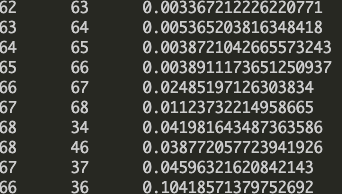

# Background

Before diving into code, the description of NJ algorithm can be found in , where first column indicates parent node, and second column is its children node, the last column is the value of edge. 

# Neighbor Joining Algorithm 

The Neighbor-joining Algorithm Given a distance matrix d compute an unrooted tree topology complete with edge lengths that tries to preserve the additive property: $d_ {i,m} + d_{j,m} − d_{i,j} = 2d_{k,m}$ where $k$ is the first node on both routes from $i$ and $j$ to $m$.

1. Let the set of clusters be called $L$ and initially $i → C_i; ∀i$ that is $| C_i | = 1$ and $L = C_1 , C_2 , . . . C_N$.

2. $d_{i,j}$ is the distance from the initial distance matrix.
   
3. Compute “normalized distance matrix” $D_{i,j}$ for all $i, j$ such that

$$\Large D_{i,j} = d_{i,j} − (r_i + r_j ) \ where\ r_i = \frac{1}{|L|-2} \sum_{z \in L} d_{i,z}$$

This subtracts the average distance to all other nodes than the pair involved. **Note: this is not where we use the distance identity.**

4. Use normalized distance to find $(i, j) = argmin D_{i,j}; C_i,C_j \in L$ 

5. Merge $C_i ∪ C_j → C_k$ where $k$ is a new cluster number.

6. Mark old clusters as used so that effectively: $L ← L − C_i − C_j$ 

7. Compute a new unnormalized distance matrix including the new cluster $k$ and excluding $i, j$.

$$\Large d_{k,z} = d_{z,k} = (d_{i,z} + d_{j,,z} − d_{i,j} ) for all z ∈ L 2$$

This uses the additivity of the distances to compute the distance to the new cluster from each other node. 

8. Compute the length of the edges from $k$ to $i$ and $j$. Even though $C_k$has assumed the role of both $C_i$ and $C_j$  you still need the edge length to $i$ and $j$ from $k$ in order to “draw” the tree.

$$\Large edge_{i,k} = (d_{i,j} + r_i − r_j)$$

$$\Large edge_{j,k} = (d_{i,j} + r_j − r_i)$$

9. Define height $h_k = d_{i,j} /2$ where $h_k$ is the height of node that is the ancestor to all in $C_k$ . When drawing the tree $h_k$ is the height above the baseline (where all the leaves are).

10.  $L ← L ∪ C_k$ 

11. While there is more than two clusters left go to step 3

12. Finally, join the remaining two clusters with:

$$\Large edge_{j,k} = d_{i,j} $$

**Implementation Notes Consider this part of the computation:**

$$\Large D_{i,j} = d_{i,j} − (r_i + r_j ) \ where \ r_i =  \frac{1}{|L|-2} \sum_{z \in L}d_{i,z}$$

The values of r_z can be computed once each time we want to compute matrix $D$. This saves a vast amount of time. Furthermore, since $D_{i,j}$ is only used to find the argmin of $D_{i,j}$ we actually don’t have to save array $D$; we only need to find the argmin of it. So first compute all the r and then combine the argmin step with the computation of $D_{i,j}$
